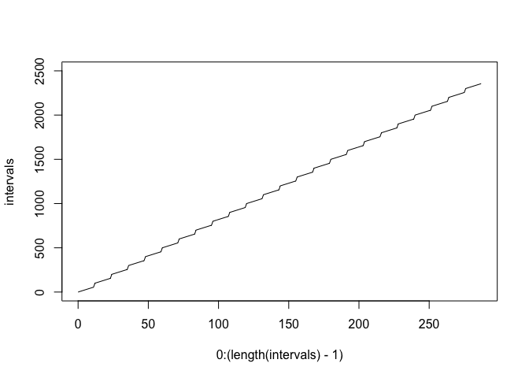

# Reproducible Research: Peer Assessment 1


## Loading and preprocessing the data


```r
unzip("activity.zip")
activity <- read.csv("activity.csv")

str(activity)
```

```
## 'data.frame':	17568 obs. of  3 variables:
##  $ steps   : int  NA NA NA NA NA NA NA NA NA NA ...
##  $ date    : Factor w/ 61 levels "2012-10-01","2012-10-02",..: 1 1 1 1 1 1 1 1 1 1 ...
##  $ interval: int  0 5 10 15 20 25 30 35 40 45 ...
```

```r
tail(activity$interval)
```

```
## [1] 2330 2335 2340 2345 2350 2355
```

```r
# Although interval is represented as integer, the integer is %H%M coded, 
# so it is not a uniform sequence:

intervals <- unique(activity$interval)
plot(0:(length(intervals) - 1), intervals, type = 'l')
```

 

```r
# Remedy this by converting to time, then to hours after midnight:

times <- strptime(sprintf("%04d", intervals), "%H%M")
hours <- difftime(times, strptime("0000", "%H%M")) / 3600

plot(hours, intervals, type = 'l')
```

 

```r
# Just in case the data are not entirely orderly:

as.hour <- function(intervals) {
    times <- strptime(sprintf("%04d", intervals), "%H%M")
    hours <- difftime(times, strptime("0000", "%H%M")) / 3600
    return(hours)
}

activity$hour = as.hour(activity$interval)
```

## What is mean total number of steps taken per day?


```r
steps_per_day = tapply(activity$steps, 
                       activity$date, 
                       function(x) sum(x, na.rm = TRUE))

summary(steps_per_day)
```

```
##    Min. 1st Qu.  Median    Mean 3rd Qu.    Max. 
##       0    6778   10400    9354   12810   21190
```

```r
hist(steps_per_day, 
     main = "Distribution of Total Reported Steps Taken Per Day", 
     xlab = "Reported Steps per Day", 
     ylab = "Days", 
     breaks = 25, xlim = c(0, 25000), ylim = c(0, 10))
```

 

```r
sprintf("Mean number of reported steps per day is %4.0f.", 
        mean(steps_per_day))
```

```
## [1] "Mean number of reported steps per day is 9354."
```

```r
sprintf("Median number of reported steps per day is %4.0f.",
        median(steps_per_day))
```

```
## [1] "Median number of reported steps per day is 10395."
```

## What is the average daily activity pattern?


```r
steps_per_interval = tapply(activity$steps, 
                            activity$hour, 
                            function(x) mean(x, na.rm = TRUE))

plot(as.numeric(names(steps_per_interval)), 
     steps_per_interval, 
     type = "l", 
     main = "Average (Over 61 Days) Reported Steps in Five-Minute Interval", 
     xlab = "Interval Start Time (Hours After Midnight)", 
     ylab = "Average Number of Steps in Interval",
     xlim = c(0, 25))
```

 

```r
summary(steps_per_interval)
```

```
##    Min. 1st Qu.  Median    Mean 3rd Qu.    Max. 
##   0.000   2.486  34.110  37.380  52.830 206.200
```

```r
wm <- which.max(steps_per_interval)
max_minutes <- as.numeric(names(wm)[1]) * 60
maxH <- as.integer(max_minutes %/% 60)
maxM <- as.integer(max_minutes %% 60)

sprintf("The five-minute interval beginning at %02d:%02d has the highest number of reported steps taken (%3.2f), averaged across the days in the dataset.", maxH, maxM, steps_per_interval[wm])
```

```
## [1] "The five-minute interval beginning at 08:34 has the highest number of reported steps taken (206.17), averaged across the days in the dataset."
```

## Imputing missing values


```r
activitySummary <- summary(activity)
print(activitySummary)
```

```
##      steps                date          interval          hour         
##  Min.   :  0.00   2012-10-01:  288   Min.   :   0.0   Length:17568     
##  1st Qu.:  0.00   2012-10-02:  288   1st Qu.: 588.8   Class :difftime  
##  Median :  0.00   2012-10-03:  288   Median :1177.5   Mode  :numeric   
##  Mean   : 37.38   2012-10-04:  288   Mean   :1177.5                    
##  3rd Qu.: 12.00   2012-10-05:  288   3rd Qu.:1766.2                    
##  Max.   :806.00   2012-10-06:  288   Max.   :2355.0                    
##  NA's   :2304     (Other)   :15840
```

```r
sprintf("There are %d NAs in activity$steps and none elsewhere.",
        as.integer(strsplit(activitySummary[7, 1], ":")[[1]][2]))
```

```
## [1] "There are 2304 NAs in activity$steps and none elsewhere."
```

```r
# Is average over day a viable way to imput missing data?

withNA <- droplevels(subset(activity, is.na(steps)))

table(withNA$date)
```

```
## 
## 2012-10-01 2012-10-08 2012-11-01 2012-11-04 2012-11-09 2012-11-10 
##        288        288        288        288        288        288 
## 2012-11-14 2012-11-30 
##        288        288
```

```r
# Dates with NAs are missing all data, so no.

# Mean over interval will work

activityImputed <- activity
activityImputed$steps[activityImputed$date %in% levels(withNA$date)] <-
    steps_per_interval

steps_per_day_imputed = tapply(activityImputed$steps, activityImputed$date, sum)

hist(steps_per_day_imputed, 
     main = "Distribution of Total (Imputed) Steps Taken Per Day", 
     xlab = "Steps per Day", 
     ylab = "Days", 
     breaks = 25, xlim = c(0, 25000), ylim = c(0, 20))
```

 

```r
summary(steps_per_day_imputed)
```

```
##    Min. 1st Qu.  Median    Mean 3rd Qu.    Max. 
##      41    9819   10770   10770   12810   21190
```

```r
sprintf("Mean number of (imputed) steps per day is %4.0f.", 
        mean(steps_per_day_imputed))
```

```
## [1] "Mean number of (imputed) steps per day is 10766."
```

```r
sprintf("Median number of (imputed) steps per day is %4.0f.",
        median(steps_per_day_imputed))
```

```
## [1] "Median number of (imputed) steps per day is 10766."
```

## Are there differences in activity patterns between weekdays and weekends?


```r
activityImputed$weekend <- sapply(as.Date(activityImputed$date), 
                                  function(x) 
                                     weekdays(x) %in% 
                                     c("Saturday", 
                                       "Sunday"))
wkends = subset(activityImputed, weekend == TRUE)
wkdays = subset(activityImputed, weekend == FALSE)
steps_per_interval_weekdays = tapply(wkdays$steps, 
                                     wkdays$hour, 
                                     mean)
steps_per_interval_weekends = tapply(wkends$steps, 
                                     wkends$hour, 
                                     mean)
require(ggplot2)
```

```
## Loading required package: ggplot2
```

```r
final <- 
    rbind.data.frame(data.frame(steps = steps_per_interval_weekends, 
                                hour = as.numeric(
                                    names(steps_per_interval_weekends)),
                                day = "Weekend"),
                     data.frame(steps = steps_per_interval_weekdays,
                                hour = as.numeric(
                                    names(steps_per_interval_weekdays)), 
                                day = "Weekday"))

str(final)
```

```
## 'data.frame':	576 obs. of  3 variables:
##  $ steps: Named num  0.21462 0.04245 0.01651 0.01887 0.00943 ...
##   ..- attr(*, "names")= chr  "0" "0.0833333333333333" "0.166666666666667" "0.25" ...
##  $ hour : num  0 0.0833 0.1667 0.25 0.3333 ...
##  $ day  : Factor w/ 2 levels "Weekend","Weekday": 1 1 1 1 1 1 1 1 1 1 ...
```

```r
qplot(hour, steps, data = final, geom = "line") + 
    facet_grid(day ~ .) + 
    labs(x = "Interval Start Time (Hours After Midnight)", 
         y = "Average Number of Steps Taken in Interval", 
         title = "Average Steps Taken in Five-Minute Interval")
```

 

