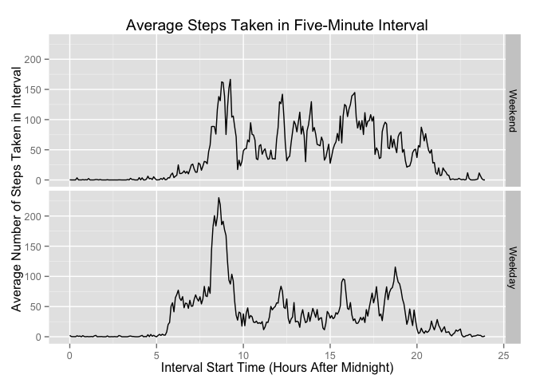

# Reproducible Research: Peer Assessment 1


## Loading and preprocessing the data


```r
unzip("activity.zip")
activity = read.csv("activity.csv")
```

## What is mean total number of steps taken per day?


```r
steps_per_day = tapply(activity$steps, 
                       activity$date, 
                       function(x) sum(x, na.rm = TRUE))
hist(steps_per_day, 
     main = "Distribution of Total Reported Steps Taken Per Day", 
     xlab = "Reported Steps per Day", 
     ylab = "Days", 
     breaks = 25, xlim = c(0, 25000), ylim = c(0, 10))
```

 

```r
sprintf("Mean number of reported steps per day is %4.0f.", 
        mean(steps_per_day))
```

```
## [1] "Mean number of reported steps per day is 9354."
```

```r
sprintf("Median number of reported steps per day is %4.0f.",
        median(steps_per_day))
```

```
## [1] "Median number of reported steps per day is 10395."
```

## What is the average daily activity pattern?


```r
steps_per_interval = tapply(activity$steps, 
                            activity$interval, 
                            function(x) mean(x, na.rm = TRUE))

plot(as.numeric(names(steps_per_interval)), 
     steps_per_interval, 
     type = "l", 
     main = "Average (Over 61 Days) Steps in Five-Minute Interval", 
     xlab = "Interval Start (Minutes after Midnight)", 
     ylab = "Average Number of Steps in Interval")
```

 

```r
which.max(steps_per_interval)
```

```
## 835 
## 104
```

## Imputing missing values


```r
activitySummary <- summary(activity)
sprintf("There are %d NAs in activity$steps and none elsewhere.",
        as.integer(strsplit(activitySummary[7, 1], ":")[[1]][2]))
```

```
## [1] "There are 2304 NAs in activity$steps and none elsewhere."
```

```r
# Is average over day a viable way to imput missing data?
withNA <- subset(activity, is.na(steps))

withNA$date = factor(withNA$date)
table(withNA$date)
```

```
## 
## 2012-10-01 2012-10-08 2012-11-01 2012-11-04 2012-11-09 2012-11-10 
##        288        288        288        288        288        288 
## 2012-11-14 2012-11-30 
##        288        288
```

```r
# Dates with NAs are missing all data, so no.

# Mean over interval will work

activityImputed <- activity
activityImputed$steps[activityImputed$date %in% levels(withNA$date)] <-
    steps_per_interval

steps_per_day_imputed = tapply(activityImputed$steps, activityImputed$date, sum)

hist(steps_per_day_imputed, 
     main = "Distribution of Total (Imputed) Steps Taken Per Day", 
     xlab = "Steps per Day", 
     ylab = "Days", 
     breaks = 25, xlim = c(0, 25000), ylim = c(0, 20))
```

 

```r
sprintf("Mean number of (imputed) steps per day is %4.0f.", 
        mean(steps_per_day_imputed))
```

```
## [1] "Mean number of (imputed) steps per day is 10766."
```

```r
sprintf("Median number of (imputed) steps per day is %4.0f.",
        median(steps_per_day_imputed))
```

```
## [1] "Median number of (imputed) steps per day is 10766."
```

## Are there differences in activity patterns between weekdays and weekends?


```r
activityImputed$weekday = sapply(as.Date(activityImputed$date), 
                                 function(x) 
                                     weekdays(x) %in% 
                                     c("Monday", 
                                       "Tuesday", 
                                       "Wednesday", 
                                       "Thursday", 
                                       "Friday"))
wkdays = subset(activityImputed, weekday == TRUE)
wkends = subset(activityImputed, weekday == FALSE)
steps_per_interval_weekdays = tapply(wkdays$steps, 
                                     as.factor(wkdays$interval), 
                                     mean)
steps_per_interval_weekends = tapply(wkends$steps, 
                                     as.factor(wkends$interval), 
                                     mean)
require(ggplot2)
```

```
## Loading required package: ggplot2
```

```r
final <- 
    rbind.data.frame(data.frame(steps = steps_per_interval_weekends, 
                                interval = seq.int(0,2355, length.out = 288),
                                day = "Weekend"),
                     data.frame(steps = steps_per_interval_weekdays,
                                interval = seq.int(0, 2355, length.out = 288), 
                                day = "Weekday"))

qplot(interval, steps, data = final, geom = "line") + 
    facet_grid(day ~ .) + 
    labs(x = "Interval Start (Minutes After Midnight)", 
         y = "Average Number of Steps Taken in Interval", 
         title = "Average Steps Taken in Five-Minute Interval")
```

 

